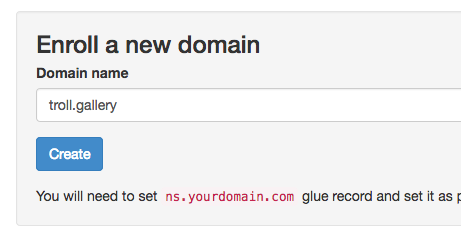
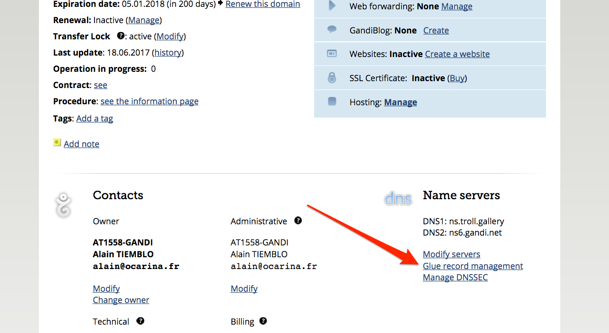
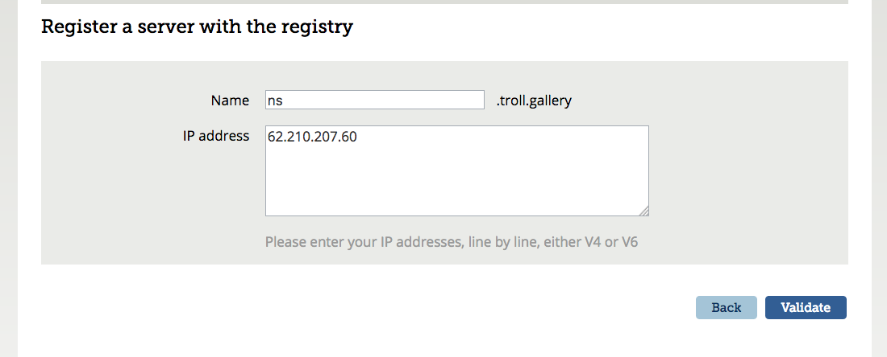
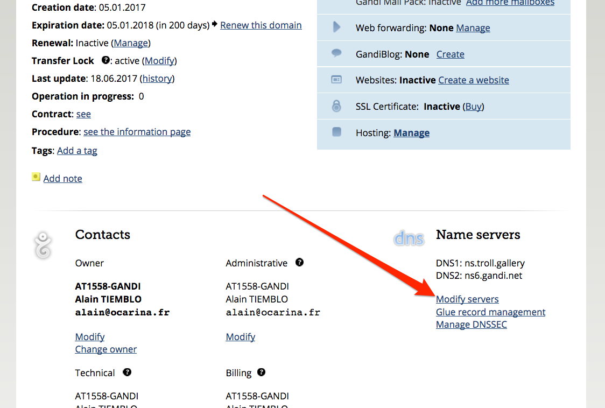
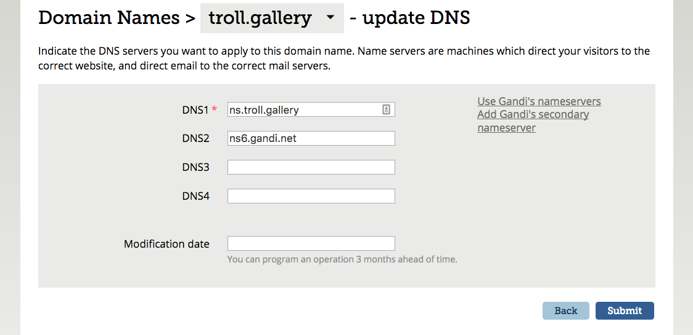

# Enroll a new domain name

There are a few actions to take at your registrar to enroll a new domain name. I'm personally using Gandi, so I'll give you the steps with Gandi.

## Add it using Lazy

The quicker your DNS server will receive the authority, the faster it will spread into the world. So let's add the domain name on Lazy first.

## Set a glue record

If you ask Gandi to move your domain name to an address that points to itself without a glue record, you will end up with a miserable failure after several long minutes.

On your domain management page, click on "Glue record management".

Then, enter your primary DNS nameserver and your server's ip. **Always `ns`**. Don't put anything else (like `ns1`) because Lazy will generate the configuration for `ns`.

## Change DNS servers

The last step is to officially delegate your domain name to your DNS server's authority.

On your domain management page, click on "Modify servers".

Now, enter the FQDN of your dns server as primary (DNS1), and that's recommanded (well, extremely advised) to use another secondary DNS server (Gandi provides it, as well as Online if you're hosted at Online.net).

If your primary DNS is dead (it may happen if your server reboots at the same time as your zone expires, or if there is a configuration issue and bind doesn't load), then the secondary DNS server will answer in your behalf. Else, downtime (for several hours for some part of the world) as your domain name will not be bound to an ip address.

This is why Lazy needs to know your secondary DNS ips (just ping on `ns6.gandi.net` in this example to have it), because they should have the right to request transfer and are thus whitelisted in our bind9 configuration.
