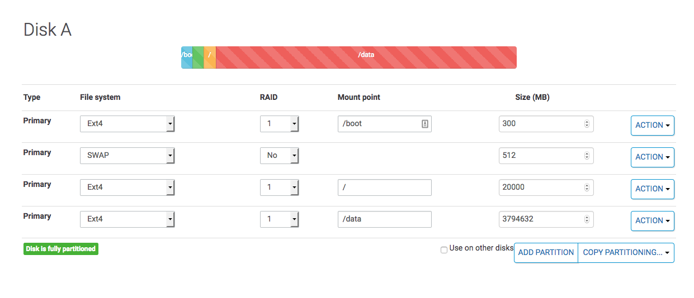
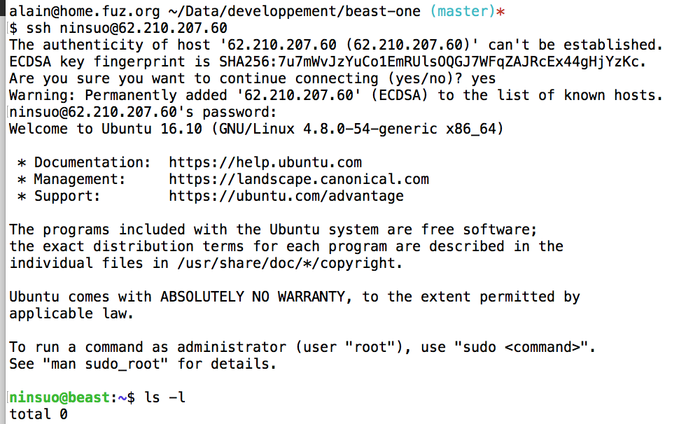

# System setup

## Welcome buddies!

You will need about 2 hours to configure everything. The first thing you should do is to fork or clone the project and open `doc/linux.md` using a markdown editor (like [Macdown](https://macdown.uranusjr.com) for ~~smart~~ mac users), and search/replace:

- `beast.systems` by your own domain name
- `alain@fuz.org` by your own email
- `ninsuo` by your own linux username
- `62.210.207.60` by your own server's ip
- `sd-50799.dedibox.fr` by your default host's subdomain

And you'll see, you'll owe me a beer but copy/paste will taste better.

## Install a distro

Ok, so I chosen an ubuntu 16.10 non LTS, because LTS is cool for 3 years and then you need to kill yourself. But you can install Debian or any decent distribution supporting `aptitude`. If not, just [go fuck yourself](http://www.amishrakefight.org/gfy/).

I have this partitioning on the HD (in fact, I've 2 disks in RAID 1, but we don't give a f*ck):



The most important thing is the `/data` directory, it will be our base for everything.

## Ok, I have access to SSH!



### sudo

If you are on Debian, you first need to install sudo:

```
su
apt-get install sudo
```

### emacs

Now let's install emacs because vi sucks (yes it does).

```sh
sudo apt-get install emacs
```

In `~/.myemacs`:

```
(setq user-full-name "alain")
(setq user-mail-address "alain@fuz.org")

(set-foreground-color "white")
(set-background-color "black")
(global-font-lock-mode t)
(menu-bar-mode -1)
(tool-bar-mode -1)
(mouse-wheel-mode 1)

(set-frame-font "-adobe-courier-medium-r-normal--12-120-75-75-m-70-iso8859-1")

(add-hook 'write-file-hooks 'delete-trailing-whitespace)
(setq backup-directory-alist '(("." . "~/.emacs_auto_save")))
(column-number-mode 1)
(setq show-trailing-whitespace t)
(setq-default show-trailing-whitespace t)
```

In `~/.emacs`:

```
(if (file-exists-p "~/.myemacs")
    (load-file "~/.myemacs")
)
```

Also copy those 2 files to root home.

```
sudo cp /home/ninsuo/.emacs /home/ninsuo/.myemacs /root/
```

### monster user

Let's add a `monster` user, it will be used by automated robots.

```sh
sudo adduser monster
```

Then, we want him to do `sudo` commands without being asked for a password. For automated actions, that's better.

```sh
sudo visudo
```

Add the following line at the bottom of the file (yes, at the bottom, because `%admin` settings may overwrite yours):

```
monster ALL=(ALL:ALL) NOPASSWD: ALL
```

Don't put your own name: if your laptop gets stolen, it would be kind of weird that thieves gets full root access on the machine. 

Copy emacs configuration to this new user.

```sh
sudo su monster
sudo cp /home/ninsuo/.emacs ~/.emacs
sudo cp /home/ninsuo/.myemacs ~/.myemacs
sudo chown monster:monster ~/.emacs
sudo chown monster:monster ~/.myemacs
```

Now, create ssh keypairs for the monster user, will be useful for automated backups without being asked for a password.

```sh
ssh-keygen -t rsa -b 4096 -C "auto@beast.systems"
```

### SSH 

Speaking about SSH, you can change ssh default port if you wish:

```sh
sudo emacs -nw /etc/ssh/sshd_config
sudo service ssh restart
```

Make sure root authentication is disabled/limited to rsa key-based.

### Primary DNS server

If you wish to use domain names (that's better on a dedicated server), you should install and configure bind.

Read the doc [here](../src/Plugin/Domain/doc/README.md)

### mysql, redis, apache, php

If you wish to manage websites, you should follow the apache & cie installation.

Read the doc [here](../src/Plugin/Website/doc/README.md)

### emails

If you wish to manage email accounts associated with your domain names, continue here.

Read the doc [here](../src/Plugin/Email/doc/README.md)

### git and github

First, insstall git:

```
sudo apt-get install git
```

Next, install your public key to GitHub: go to your [SSH keys settings](https://github.com/settings/keys) and clic "New SSH key". Put a title (like `beast.systems`) and copy/paste your `~/.ssh/id_rsa.pub`.

This will have the same effect as putting this public key to your GitHub's account `authorized_keys`.
