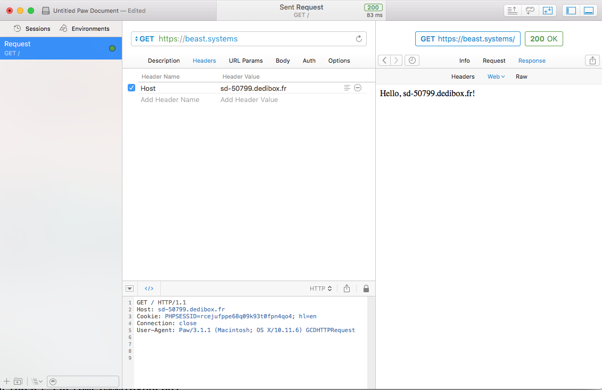

# Usage without lazy

This documentation summarize the steps that lazy use to install a new website.

## Directory structure

In `/etc/apache2`, there are two main directories:

- `sites-available` contains all websites configuration files.

```sh
ninsuo@beast:~$ ls -l /etc/apache2/sites-available/
total 28
-rw-r--r-- 1 root root  420 Jun 18 06:42 000-62.210.207.60.conf
-rw-r--r-- 1 root root  483 Jun 17 21:11 000-beast.systems-le-ssl.conf
-rw-r--r-- 1 root root  600 Jun 18 06:42 000-beast.systems.conf
-rw-r--r-- 1 root root  508 Jun 18 05:15 000-sd-50799.dedibox.fr-le-ssl.conf
-rw-r--r-- 1 root root  575 Jun 18 06:43 000-sd-50799.dedibox.fr.conf
-rw-r--r-- 1 root root 6338 Apr  5  2016 default-ssl.conf
```

- `sites-enabled` contains enabled websites, as symbolic links pointing to the right configuration file.

```sh
ninsuo@beast:~$ ls -l /etc/apache2/sites-enabled/
total 4
lrwxrwxrwx 1 root root 41 Jun 18 04:52 000-62.210.207.60.conf -> ../sites-available/000-62.210.207.60.conf
lrwxrwxrwx 1 root root 58 Jun 17 21:11 000-beast.systems-le-ssl.conf -> /etc/apache2/sites-available/000-beast.systems-le-ssl.conf
lrwxrwxrwx 1 root root 41 Jun 17 21:05 000-beast.systems.conf -> ../sites-available/000-beast.systems.conf
lrwxrwxrwx 1 root root 64 Jun 18 05:15 000-sd-50799.dedibox.fr-le-ssl.conf -> /etc/apache2/sites-available/000-sd-50799.dedibox.fr-le-ssl.conf
lrwxrwxrwx 1 root root 47 Jun 18 05:13 000-sd-50799.dedibox.fr.conf -> ../sites-available/000-sd-50799.dedibox.fr.conf
```

Note that all `-le-ssl.conf` files are generated automatically by Let's Encrypt (`le`). 

## Configure a website

A website is a set of two XML elements: `Directory` and `VirtualHost`.

```apache
<Directory /data/sites/beast.systems/exposed>
        Options Indexes FollowSymLinks
        AllowOverride All
        Require all granted
</Directory>

<VirtualHost *:80>
	ServerName beast.systems
	ServerAdmin ninsuo@gmail.com
	DocumentRoot /data/sites/beast.systems/exposed/
	ErrorLog ${APACHE_LOG_DIR}/error.log
	CustomLog ${APACHE_LOG_DIR}/access.log combined
</VirtualHost>
```

Nothing really difficult. Some notes anyway:

- `Indexes` option will add a directory listing page when indexes are not available. Don't hesitate to disable it when not needed.

- `ServerName` should match what will be contained in the `Host:` header. So you can easily test your website even if your domain name isn't yet bound by updating your `Host:` header accordignly (using softwares like [Paw](https://paw.cloud)). 



## Aliases

If you want your website to be available both at `https://beast.systems` and `https://www.beast.systems`, you can use the `ServerAlias` option:

```apache
<VirtualHost *:80>
	ServerName beast.systems
	ServerAlias www.beast.systems
	(...)
</VirtualHost>
```

You can have as many `ServerAlias` as you want. You will need one certificate per alias though.

You can also use wildcards on aliases, so `ServerAlias *.beast.systems` will expose the same application if you're going to `http://foo.beast.systems` and `http://bar.beast.systems`. But be careful, Let's encrypt do not support wildcard certificates, so you'll need to redirect your wildcard to a single domain (see below).

## Redirections

If you wish to redirect all HTTP traffic to HTTPS, you should add in your `VirtualHost` configuration:

```
RewriteEngine on
RewriteCond %{SERVER_NAME} =beast.systems [OR]
RewriteCond %{SERVER_NAME} =www.beast.systems
RewriteRule ^ https://%{SERVER_NAME}%{REQUEST_URI} [END,NE,R=permanent]
```

If you wish to redirect a wilcard alias to a single domain name, for example redirecting `*.beast.systems` to `beast.systems`:

```apache
<VirtualHost *:443>
	ServerName beast.systems
	ServerAlias *.beast.systems
	(...)
</VirtualHost>
```

You will need to use this in your VirtualHost configuration:

```apache
RewriteEngine On
RewriteCond %{HTTP_HOST} !^beast.systems$ [NC]
RewriteRule ^(.*)$ https://beast.systems/$1 [R=301,NC,L]
```

## Secure your website

To add a certificate without any user interaction:

```sh
sudo certbot --non-interactive --agree-tos --email alain@fuz.org --apache --domains beast.systems
 ```

To remove one certificate without any user interaction:

```sh
sudo rm /etc/apache2/sites-enabled/000-beast.systems-le-ssl.conf
sudo certbot delete --non-interactive --apache --agree-tos --cert-name beast.systems
sudo service apache2 restart
```

You may need to regenerate your `000-beast.systems.conf` so it doesn't redirect to HTTPS.
